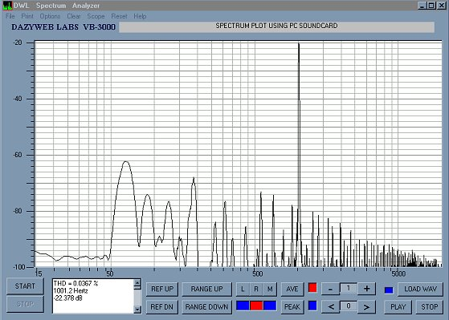



## Audio Spectrum Analyzer

### Description

16K sample FFT based spectrum analyzer based on Deeth's original code, with print plot, file saving and loading, multiple sample rates, oscilloscope, average and peak hold, left/right/mono channel selection.
 
### More Info
 
Requires full duplex soundcard.

             |
---                |---
**Submitted On**   |2001-06-02 20:53:48
**By**             |[Vic Richardson](https://github.com/Planet-Source-Code/PSCIndex/blob/master/ByAuthor/vic-richardson.md)
**Level**          |Advanced
**User Rating**    |4.9 (103 globes from 21 users)
**Compatibility**  |VB 6\.0
**Category**       |[Complete Applications](https://github.com/Planet-Source-Code/PSCIndex/blob/master/ByCategory/complete-applications__1-27.md)
**World**          |[Visual Basic](https://github.com/Planet-Source-Code/PSCIndex/blob/master/ByWorld/visual-basic.md)
**Archive File**   |[Audio Spec20528632001\.zip](https://github.com/Planet-Source-Code/vic-richardson-audio-spectrum-analyzer__1-23746/archive/master.zip)

